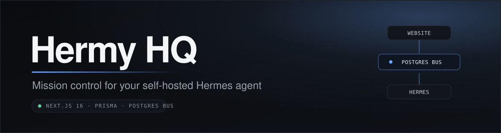
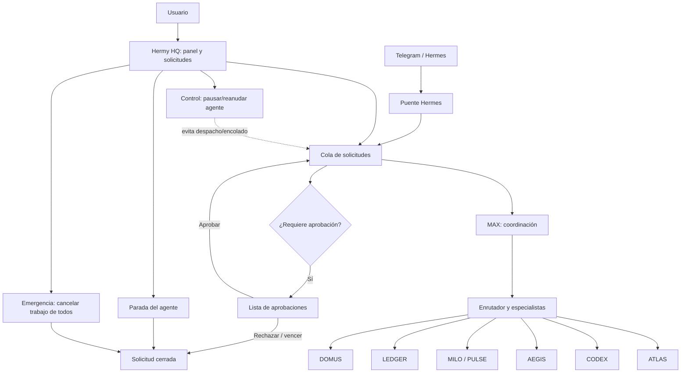

# Hermy HQ personalizado

Banner original del Hermy HQ instalado en este proyecto.

Código activo de la aplicación Hermy HQ, el panel de coordinación y el puente Hermes del despliegue del VPS. El repo contiene fuentes, migraciones, manifiestos de dependencias y configuración de servicio de ejemplo. Excluye la base de datos en ejecución, entornos, registros, compilaciones, dependencias instaladas y respaldos internos.

Este proyecto se integra con [Hermes Agent Personalized](https://github.com/Reynaldo8509/hermes-agent-personalized) y [Home Assistant Personalized](https://github.com/Reynaldo8509/home-assistant-personalized).

## Mapa visual de la integración

La ilustración resume visualmente el ecosistema. El diagrama Mermaid y las secciones siguientes describen los flujos implementados con etiquetas precisas.

## Funciones que muestra el proyecto

- Panel de agentes con estado, actividad y controles individuales de pausa/reanudación.
- Control de parada de un agente y control de emergencia para cancelar trabajo activo global.
- Flujo de solicitudes y aprobaciones con estados pendientes, aprobadas, rechazadas y vencidas.
- Puente Hermes que coloca solicitudes, asigna especialistas, evita encolar seguimiento para agentes pausados y conserva historial de solicitudes.
- Vistas de actividad, historial, tareas, costes, salud y aprobaciones.

## Agentes configurados

MAX coordina; ATLAS investiga; CODEX desarrolla; AEGIS realiza tareas de seguridad; MILO y PULSE cubren funciones auxiliares configuradas; LEDGER operaciones/continuidad; DOMUS hogar. El catálogo activo y las capacidades específicas están definidos en el código y pueden cambiar con la configuración.

## Diagrama

## Ejecución de una tarea

1. Una solicitud entra desde el panel, Telegram o un observador programado.
2. El puente determina la categoría, aplica el estado de pausa y agrega una solicitud a la cola.
3. MAX puede coordinar y delegar trabajo especializado; las rutas se registran en la cola.
4. Las tareas con efectos laterales esperan aprobación antes de ejecutarse. La interfaz permite revisar, aprobar o rechazar. Las aprobaciones pendientes caducan según la política del servidor.
5. El panel actualiza estado y conserva los resultados en la base de datos de producción, que no se publica.

Las acciones concretas, categorías y estados se definen en `hermes-bridge/bridge.mjs`, `src/app/api/agents/control/route.ts`, `src/app/api/hermes/approvals/route.ts` y `src/app/agents/page.tsx`. La parada de emergencia cierra solicitudes activas y termina workers registrados; no es un apagado del VPS.

## Instalación y configuración

Ejecuta `./install.sh` tras crear `.env` en privado. Consulta `ONBOARDING.md` y `package.json` para requisitos. Prepara PostgreSQL, copia `.env.example` como `.env` y completa sus marcadores localmente, aplica las migraciones Prisma y ejecuta el servidor Next.js según el script de producción. Configura el puente Hermes como proceso de servicio separado tras revisar `deploy/systemd/`. No reutilices una base de datos real ni secretos del despliegue publicado.

## Privacidad

No se publican tokens, `.env`, bases de datos, historiales, contenido generado privado, mensajes de Telegram, claves, logs ni archivos de respaldo. Los ejemplos deben completarse localmente.
